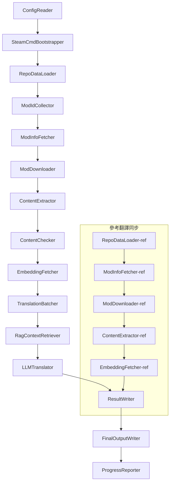

# Project Babel 技術文檔

> **目標**: Project Zomboid 多模組 AI 翻譯管線
> **語言**: C# / .NET 10
> **執行環境**: GitHub Actions (Linux x64) / 本地 (Windows x64)
> **程式碼庫**: [PZProjectBabel/project_babel](https://github.com/PZProjectBabel/project_babel)

---

> [English](technical_reference_en.md) | [简体中文](technical_reference_zh-hans.md) <details><summary>Other Languages</summary>[العربية](technical_reference_ar.md) | [català](technical_reference_ca.md) | [繁體中文](technical_reference_zh-hant.md) | [čeština](technical_reference_cs.md) | [dansk](technical_reference_da.md) | [Deutsch](technical_reference_de.md) | [español](technical_reference_es.md) | [suomi](technical_reference_fi.md) | [français](technical_reference_fr.md) | [magyar](technical_reference_hu.md) | [Bahasa Indonesia](technical_reference_id.md) | [italiano](technical_reference_it.md) | [日本語](technical_reference_ja.md) | [한국어](technical_reference_ko.md) | [Nederlands](technical_reference_nl.md) | [norsk](technical_reference_no.md) | [Tagalog](technical_reference_tl.md) | [polski](technical_reference_pl.md) | [português](technical_reference_pt.md) | [português do Brasil](technical_reference_pt-br.md) | [română](technical_reference_ro.md) | [русский](technical_reference_ru.md) | [ภาษาไทย](technical_reference_th.md) | [Türkçe](technical_reference_tr.md) | [українська](technical_reference_uk.md)</details>

---

### 背景與動機

  - [核心能力](#核心能力)
  - [核心能力](#核心能力)
- [1. 系統架構](#1-系統架構)
  - [整體架構](#整體架構)
- [1. 系統架構](#1-系統架構)
  - [整體架構](#整體架構)
  - [兩大處理階段](#兩大處理階段)
  - [核心資料流](#核心資料流)
- [2. 管線工作流程](#2-管線工作流程)
  - [Phase 1: 配置載入與 SteamCMD 初始化](#phase-1-配置載入與-steamcmd-初始化)
  - [Phase 2: 參考翻譯同步 (Steps 2-3)](#phase-2-參考翻譯同步-steps-2-3)
  - [Phase 3: 主翻譯循環 (Steps 4-14)](#phase-3-主翻譯循環-steps-4-14)
  - [Phase 4: 輸出與報告 (Steps 15-20)](#phase-4-輸出與報告-steps-15-20)
- [3. 各模組原理與技術細節](#3-各模組原理與技術細節)
  - [3.1 ConfigReader (`ConfigReaderService`)](#31-configreader-configreaderservice)
  - [3.2 RepoDataLoader (`RepoDataLoaderService`)](#32-repodataloader-repodataloaderservice)
  - [3.3 ModIdCollector (`ModIdCollectorService`)](#33-modidcollector-modidcollectorservice)
  - [3.4 ModInfoFetcher（`ModInfoFetcherService`）](#34-modinfofetchermodinfofetcherservice)
  - [3.5 SteamCmdBootstrapper（`SteamCmdBootstrapperService`）](#35-steamcmdbootstrappersteamcmdbootstrapperservice)
  - [3.5.1 ModDownloader（`ModDownloaderService`）](#351-moddownloadermoddownloaderservice)
  - [3.6 ContentExtractor (`ContentExtractorService`)](#36-contentextractor-contentextractorservice)
  - [3.7 ContentChecker (`ContentCheckerService`)](#37-contentchecker-contentcheckerservice)
  - [3.8 EmbeddingFetcher (`EmbeddingFetcherService`)](#38-embeddingfetcher-embeddingfetcherservice)
  - [3.9 TranslationBatcher (`TranslationBatcherService`)](#39-translationbatcher-translationbatcherservice)
  - [3.10 RagContextRetriever (`RagContextRetrieverService`)](#310-ragcontextretriever-ragcontextretrieverservice)
  - [3.11 LLMTranslator (`LLMTranslatorService`)](#311-llmtranslator-llmtranslatorservice)
  - [3.12 ResultWriter (`ResultWriterService`)](#312-resultwriter-resultwriterservice)
  - [3.13 FinalOutputWriter (`FinalOutputWriterService`)](#313-finaloutputwriter-finaloutputwriterservice)
  - [3.14 ProgressReporter (`ProgressReporterService`)](#314-progressreporter-progressreporterservice)
- [獨立模組](#獨立模組)
  - [WorkshopMonitor (`WorkshopMonitorService`)](#workshopmonitor-workshopmonitorservice)
  - [DocGenerator](#docgenerator)
- [4. 資料約定](#4-資料約定)
  - [4.1 核心類型](#41-核心類型)
    - [`TranslationEntry` — 翻譯條目](#translationentry-翻譯條目)
    - [`TranslationData` — 翻譯資料](#translationdata-翻譯資料)
    - [`ModInfo` — Mod 元數據](#modinfo-mod-元數據)
    - [`TranslationBatch` — 翻譯批次](#translationbatch-翻譯批次)
    - [`LangInfoData` — 語言資訊](#langinfodata-語言資訊)
  - [4.2 檔案格式](#42-檔案格式)
    - [提取輸出（ContentExtractor 產出）](#提取輸出contentextractor-產出)
    - [鍵映射檔案](#鍵映射檔案)
    - [翻譯快取（data/translations/）](#翻譯快取datatranslations)
    - [最終輸出（final_outputs/）](#最終輸出final_outputs)
    - [嵌入向量（data/embeddings/*.bin）](#嵌入向量dataembeddingsbin)
  - [4.3 索引鍵約定](#43-索引鍵約定)
  - [4.4 狀態機](#44-狀態機)
    - [ContentCheck 內容審查狀態](#contentcheck-內容審查狀態)
    - [TranslationData 翻譯驗證狀態](#translationdata-翻譯驗證狀態)
    - [ModInfo.needsUpdate 更新判定](#modinfoneedsupdate-更新判定)
- [5. 配置說明](#5-配置說明)
  - [5.1 `config/config.json` — 管線主配置](#51-configconfigjson-管線主配置)
    - [5.1.1 `LLM` — 大語言模型配置](#511-llm-大語言模型配置)
    - [5.1.2 `RAG` — 檢索增強生成配置](#512-rag-檢索增強生成配置)
    - [5.1.3 `AsOne` — 遠端 Mod 列表源](#513-asone-遠端-mod-列表源)
    - [5.1.4 `Steam` — Steam Web API 設定](#514-steam-steam-web-api-設定)
    - [5.1.5 `Pipeline` — 管線通用設定](#515-pipeline-管線通用設定)
    - [5.1.6 `ContentCheck` — 內容安全審查設定](#516-contentcheck-內容安全審查設定)
    - [5.1.7 `Settings` — 管線基礎設定](#517-settings-管線基礎設定)
    - [5.1.8 `Embedding` — 嵌入服務設定](#518-embedding-嵌入服務設定)
    - [5.1.9 `Workflow` — 工作流設定](#519-workflow-工作流設定)
  - [5.2 `config/secrets.json` — 金鑰設定](#52-configsecretsjson-金鑰設定)
  - [5.3 `config/supported_languages.json` — 支援語言列表](#53-configsupported_languagesjson-支援語言列表)
  - [5.4 `config/ref_translation_mods.json` — 參考翻譯模組](#54-configref_translation_modsjson-參考翻譯模組)
  - [5.5 `config/request_for_translation.txt` — 本地翻譯請求](#55-configrequest_for_translationtxt-本地翻譯請求)
  - [5.6 配置載入流程](#56-配置載入流程)
- [6. 目錄結構](#6-目錄結構)
- [7. 運行方式](#7-運行方式)
  - [本地運行（Windows x64）](#本地運行windows-x64)
  - [CI 運行（GitHub Actions，Linux x64）](#ci-運行github-actionslinux-x64)
  - [執行結果判斷](#執行結果判斷)
- [8. 關鍵設計決策](#8-關鍵設計決策)

---

Project Babel 通過構建一條全自動化的 AI 翻譯管線來解決這些問題。它能夠自動發現新模組、下載模組檔案、提取待翻譯文本、利用大語言模型（LLM）生成高品質翻譯，並最終輸出玩家可直接使用的漢化補丁。

### 核心能力

- **自動發現**：從社群平台（AsOne）和本地請求列表自動收集待翻譯的模組 ID。

- **增量更新**：檢測模組內容變化，僅翻譯新增或修改的文本，避免重複工作。
- **安全審查**：自動檢測並過濾含有違規內容（毒品、色情等）的模組。
- **多語言支持**：管線架構支援 27 種目標語言，當前主要服務於簡體中文（zh-hans）。

Project Babel 通过构建一条全自动化的 AI 翻译管线来解决这些问题。它能够自动发现新模组、下载模组文件、提取待翻译文本、利用大语言模型（LLM）生成高质量翻译，并最终输出玩家可直接使用的汉化补丁。

### 核心能力

- 理解管線的整體架構和數據流向。
- 掌握每個處理模組的職責和內部原理。
- 了解配置檔案的結構和各項參數的含義。
- 具備在本地或 CI 環境中運行管線的能力。
- **多语言支持**：管线架构支持 27 种目标语言，当前主要服务于简体中文（zh-hans）。
## 1. 系統架構

### 整體架構

管線採用經典的「流水線」（Pipeline）架構，由 15 個獨立模組按順序串聯而成。每個模組只負責一個明確的子任務，模組之間通過記憶體中的資料結構傳遞資料，最終產出可發布的翻譯檔案。
- 理解管线的整体架构和数据流向。
掌握每個處理模組的職責和內部原理。
了解配置文件的結構和各項參數的含義。
具備在本地或 CI 環境中運行管線的能力。

---

## 1. 系統架構

### 整體架構

管線採用經典的「流水線」（Pipeline）架構，由 15 個獨立模組按順序串聯而成。每個模組只負責一個明確的子任務，模組之間通過記憶體中的資料結構傳遞資料，最終產出可發布的翻譯檔案。



> **注**：參考翻譯同步路徑中，`RepoDataLoader-ref` 從 `translation_ref/` 目錄加載緩存數據作為起點，而非從 `ConfigReader` 獲取輸入。

### 兩大處理階段

管線包含兩條並行的處理路徑，分別服務於不同的目的：

| 階段 | 路徑 | 處理對象 | 目的 |
|------|------|----------|------|
| **參考翻譯同步** | 圖中下方子圖 | 高質量既存漢化模組（`translation_ref/`） | 構建 RAG 檢索用的參考語料庫 |
| **主翻譯循環** | 圖中上方主鏈路 | 待翻譯的普通模組（`data/`） | 執行實際的 AI 翻譯 |

兩條路徑最終匯入 `ResultWriter` 和 `FinalOutputWriter`，統一生成分發文件。

這種分離設計的優勢在於：參考翻譯模組通常由人工精心翻譯，應當獨立維護且優先同步；而主翻譯循環處理的是待 AI 翻譯的大批量模組。兩者的變更頻率和處理邏輯不同，分開管理可以避免相互干擾。

### 核心資料流

從宏觀視角看，資料在管線中的流轉路徑如下：
```
config.json / secrets.json
→ Mod ID 收集（AsOne 社群 + 本地請求）
→ Steam 元資料查詢（名稱、作者、更新時間等）
→ steamcmd 下載模組檔案
→ 文字提取（解析為 TranslationEntry 物件）
→ 內容安全審查（過濾違規內容）
→ 向量嵌入計算（為 RAG 檢索做準備）
→ 批次打包（TranslationBatch，含 token 預算控制）
→ RAG 相似度檢索（匹配參考翻譯作為上下文）
→ LLM 翻譯（呼叫大語言模型產生譯文）
→ 結果寫回快取（data/translations/）
→ 最終輸出（final_outputs/project_babel/）
```

每一步的輸出是下一步的輸入，形成一條完整的「資料加工流水線」。管線中的每個模組都會在第 3 節中詳細展開。

---

## 2. 管線工作流程

管線的全部邏輯由 `Program.cs` 中的 `PipelineRunner.RunAsync()` 方法統一編排，共包含約 20 多個處理步驟。為了便於理解，我們將這些步驟按職責劃分為四個階段。下面逐一說明每個階段的工作內容和設計意圖。

### Phase 1: 配置載入與 SteamCMD 初始化

一切工作的起點是載入和校驗配置檔案。這一階段雖然簡單，卻是整個管線穩定執行的基礎——任何配置錯誤都應盡早發現、立即終止，避免浪費計算資源。

- `ConfigReader.LoadConfig()` 負責讀取 `config/config.json`（管線參數）和 `config/secrets.json`（敏感金鑰）。
- 載入完成後立即校驗所有必填項：如果 LLM API Key 為空，說明無法呼叫翻譯服務，此時直接呼叫 `Environment.Exit(1)` 終止程序，避免進入後續無意義的處理步驟。
- 同時解析 `config/supported_languages.json`，將 27 種語言的定義載入為 `List<LangInfoData>`，供後續所有模組查詢語言代碼對應。
- `SteamCmdBootstrapper` 隨後準備下載器所需的執行時期：Linux 下載並解壓官方 `steamcmd_linux.tar.gz`；Windows 原地執行倉庫中已存在的 `src/3rd_party/steamcmd/steamcmd.exe +quit` 自更新，缺少該可執行檔會立即失敗。

詳細的配置欄位說明請參見第 5 節。

### Phase 2: 參考翻譯同步 (Steps 2-3)

在主翻譯循環開始之前，管線會先同步**參考翻譯**（Reference Translation）資料。

**什麼是參考翻譯？** 參考翻譯是指由社群人工精心翻譯的高品質漢化模組。這些模組的譯文準確、術語統一，是寶貴的語料資源。管線不直接使用參考翻譯的文字作為最終輸出（那會侵犯原作者的權益），而是將其作為 RAG（檢索增強生成）的知識庫——當 LLM 翻譯某個文字時，管線會從參考語料庫中檢索語義相似的翻譯作為「參考範例」，幫助 LLM 理解上下文、統一術語風格，從而產生品質更高的譯文。

這一階段的具體步驟：
1. **加載緩存**：`RepoDataLoader` 從 `translation_ref/` 目錄載入上一次運行保存的參考資料，包括模組元資訊、已提取的翻譯條目和嵌入向量。這些緩存可以避免每次運行時都重新下載和解析所有參考模組。
2. **同步 Steam 元資料**：`ModInfoFetcher` 向 Steam Web API 查詢每個參考模組的最新資訊（主要是 `time_updated` 字段），與緩存中的 `timeModUpdated` 比較，標記出內容有變化的模組（`needsUpdate = true`）。
3. **增量更新**：僅對那些被標記為 `needsUpdate` 的參考模組執行「下載 → 文本提取 → 嵌入計算」的完整流程。未變化的模組直接複用緩存，大幅節省時間和頻寬。
4. **持久化寫回**：`ResultWriter.WriteRefDataAsync()` 將更新後的參考資料寫回 `translation_ref/`，供下次運行使用。

### Phase 3: 主翻譯循環 (Steps 4-14)

這是管線的核心階段，執行從「發現模組」到「生成翻譯」的完整流程。參考翻譯同步完成後，管線已經擁有了高品質的參考語料庫；現在它將對所有待翻譯的普通模組執行同樣的處理，並在最終翻譯步驟中充分利用這些參考語料。

| Step | 模組 | 功能 |
|------|------|------|
| 4 | RepoDataLoader | 加載 `data/` 目錄中的緩存資料（模組元資訊、已有翻譯、嵌入向量），恢復上一次運行的狀態 |
| 5 | ModIdCollector | 從 AsOne 社群平台和本地 `request_for_translation.txt` 收集所有待翻譯的 Mod ID，合併去重 |
| 6 | ModInfoFetcher | 透過 Steam Web API 批量查詢每個模組的最新元資料（名稱、作者、更新時間等） |
| 7 | ModDownloader | 使用 steamcmd 工具分批下載 Workshop 模組檔案到本地臨時目錄 |
| 8 | ContentExtractor | 解析下載的模組檔案，從 `Translate/` 目錄中提取所有待翻譯的文本條目（`TranslationEntry`） |
| 9 | — | 📊 **差異對比**：將新提取的條目與緩存逐一比對，識別出新增、修改和未變化的條目，只有前兩者進入後續翻譯流程 |
| 10 | ContentChecker | 使用 LLM 對模組內容進行安全審查，識別涉毒、涉黃等違規內容，標記不合規的模組 |
| 11 | EmbeddingFetcher | 呼叫遠端嵌入服務，為每個待翻譯文本生成向量嵌入（384 維），用於後續的語義相似度檢索 |
| 12 | TranslationBatcher | 將待翻譯條目按模組分組並打包為批次（TranslationBatch），每個批次受 `batch_size` 和 `batch_token_budget` 雙重約束 |
| 13 | RagContextRetriever | 對每個待譯條目，在參考語料庫中檢索語義最相似的已有翻譯，作為 LLM 翻譯時的上下文參考 |
| 14 | LLMTranslator | 呼叫大語言模型 API 執行翻譯，包含預熱探測（warmup）和動態並發控制，是整個管線最複雜的模組 |

### Phase 4: 輸出與報告 (Steps 15-20)

所有翻譯工作完成後，管線進入收尾階段——將結果持久化到檔案系統，並生成可供玩家直接使用的最終分發檔案。

| Step | 模組 | 輸出 |
|------|------|------|
| 15 | ResultWriter | 將模組元資訊寫回 `data/modinfos.json`，翻譯條目寫回 `data/translations/<iso>/`，嵌入向量寫回 `data/embeddings/` |
| 16 | ResultWriter | 按每種目標語言分別寫入翻譯結果，格式為 `translationKey::lang::status = "value"` |
| 17 | FinalOutputWriter | 生成符合 Project Zomboid 模組目錄規範的最終分發檔案，玩家可直接放入遊戲的 Mods 目錄使用 |
| 18 | — | 彙總運行過程中產生的所有警告資訊，寫入 `temp/run_*/warnings/` 供人工檢查 |
| 19 | ProgressReporter | 統計各語言的翻譯覆蓋率，生成多語言進度報告（`docs/progress/progress_*.md`） |

---

## 3. 各模組原理與技術細節

### 3.1 ConfigReader (`ConfigReaderService`)

**功能**: 載入並校驗所有配置檔案，是整個管線的入口模組。

`ConfigReader` 是管線啟動後第一個執行的模組。它的核心職責是讀取 `config/` 目錄下的所有設定檔，將它們反序列化為強類型的 `PipelineConfig` 物件，並在載入完成後執行完整性校驗。

具體工作包括：
- **解析主配置**：讀取 `config/config.json`，反序列化為 `PipelineConfig` 物件。這個物件包含了 LLM 參數、並發策略、RAG 閾值、Steam API 參數等所有運行時設定。
- **解析密鑰**：讀取 `config/secrets.json`，提取 LLM API Key、Steam Web API Key、嵌入服務金鑰和地址等敏感資訊。
- **關鍵校驗**：檢查 `LLM_KEY`、`STEAM_KEY`、`EMBEDDING_KEY` 三個必填金鑰是否為空。任一為空則拋出例外終止管線。金鑰可以從 `secrets.json` 或環境變數中獲取（環境變數優先級更高）。
- **解析語言列表**：讀取 `config/supported_languages.json`，建構 `List<LangInfoData>`。這個列表定義了管線需要處理的所有目標語言（共 27 種），後續的翻譯、輸出、報告等模組都依賴它。
- **解析參考模組列表**：讀取 `config/ref_translation_mods.json`，獲取作為 RAG 語料的參考漢化模組列表。
- **初始化臨時目錄**：創建本次運行所需的臨時目錄結構（如 `runTempDir` 用於存放中間檔案，`downloadedModsTempDir` 用於存放下載的模組檔案），確保後續模組有處可寫。

詳細的配置欄位和含義請參見第 5 節。

### 3.2 RepoDataLoader (`RepoDataLoaderService`)

**功能**: 管理所有本地快取資料的載入、比對和狀態維護。

`RepoDataLoader` 是管線的「記憶系統」。每次管線運行時，它負責從本地檔案系統載入上一次運行儲存的所有資料（翻譯快取、嵌入向量、模組元資訊等），使得管線能夠識別哪些內容是新的、哪些已經處理過、哪些發生了變化。沒有這個模組，管線每次都需要從頭處理所有模組，效率極低。

**載入的資料類型**：

| 資料 | 儲存位置 | 載入後的用途 |
|------|----------|-------------|
| Mod 元資訊 | `data/modinfos.json` | 判斷哪些 mod 需要更新、哪些是首次處理 |
| 翻譯快取 | `data/translations/<iso>/*.txt` | 填充 `TranslationEntry.translationValues`，避免重複翻譯已有的文字 |
| 嵌入向量 | `data/embeddings/*.bin` | Zstd 壓縮的二進位向量資料，填充 `embeddingValues`，文字未變時可重用向量 |
| 條目中繼資料 | `data/entry_metadata/*.json` | 記錄每個條目的 `sourceHash`、`isActive` 等狀態資訊 |

**三個核心方法**：
- `DiffTranslationEntries()`：將新提取的條目與快取中的條目逐條比對。根據 `sourceHash`（基準文字的 SHA256 雜湊）判斷每條文字是新增（new）、修改（changed）還是未變（unchanged）。只有 new 和 changed 條目才需要進入後續的嵌入計算和翻譯流程，unchanged 條目直接重用快取。
- `ComputeSourceHash()`：對基準文字計算 SHA256 雜湊值，作為文字內容的「指紋」。雜湊碰撞機率極低，可以可靠地用於變更偵測。
- `MarkMissingFreshEntriesInactive()`：如果某條快取中的舊條目在新提取結果中找不到（說明模組作者刪除了這條文字），則將其標記為 `isActive = false`，保留歷史記錄但不再參與翻譯。

### 3.3 ModIdCollector (`ModIdCollectorService`)

**功能**: 從多個來源收集所有待翻譯的 Steam Workshop Mod ID，合併去重後形成統一的待處理列表。

管線需要知道「哪些模組需要翻譯」。這個資訊來自兩個渠道：
**來源 1 — AsOne 遠端社群清單**：
[AsOne](https://www.asone.fun/) 是一個 Project Zomboid 中文漢化組的翻譯平台，維護了一份公開的模組清單。管線透過 HTTP GET 請求其 API（`api/Home/GetAllModinfo`）獲取所有已登記的模組 ID。請求以匿名方式發送，連續逾時 3 次則跳過遠端清單。

**來源 2 — 本地翻譯請求檔案**：
`config/request_for_translation.txt` 是一個手動維護的模組 ID 清單，每行一個純數字的 Workshop ID。以 `#` 開頭的行為註解，空白行自動跳過。這個檔案用於補充 AsOne 清單中未覆蓋但社群有翻譯需求的模組。

**合併策略**：兩個來源的 ID 清單合併時，以 AsOne 遠端清單為主，本地請求檔案中不在遠端清單中的 ID 作為補充加入。已存在的 ID 不會重複新增。最終輸出一個去重後的完整 ID 清單。

### 3.4 ModInfoFetcher（`ModInfoFetcherService`）

**功能**：通過 Steam Web API 批量查詢模組的詳細元數據，判斷哪些模組需要更新。

拿到 Mod ID 列表後，管線需要知道每個模組的基本資訊——名稱、作者、最後更新時間等。這些資訊通過 Steam 官方的 `ISteamRemoteStorage/GetPublishedFileDetails/v1/` 介面獲取。

**工作細節**：
- **分塊請求**：Steam API 每次調用有數量限制，因此管線按 `steamApiChunkSize`（預設 100）分批發送請求。每批之間適當間隔，避免觸發限流。
- **容錯機制**：如果連續 5 個批次全部失敗（可能是網路問題或 API 暫時不可用），管線會終止查詢並保留已成功獲取的部分資料，而不是丟棄所有結果。
- **關鍵字段映射**：
- `consumer_app_id`：判斷該物品是否屬於 Project Zomboid（App ID = `108600`）。不屬於 PZ 的模組標記為 `isAvailable = false`，後續跳過下載。
- `time_updated`：Steam 記錄的最後更新時間。與快取中的 `timeModUpdated` 比較，如果前者更新，則標記 `needsUpdate = true`，表示模組內容可能發生了變化，需要重新提取和翻譯。
- `title` → 映射為 `modName`（模組名稱）。
- `creator` → 透過 Steam 使用者介面獲取創建者暱稱。

### 3.5 SteamCmdBootstrapper（`SteamCmdBootstrapperService`）

**功能**：在所有下載操作開始前準備當前平台可用的 steamcmd 執行環境。

- **Linux**：清理 `src/3rd_party/steamcmd/` 中舊的執行時檔案，下載並解壓官方 `steamcmd_linux.tar.gz`，並為 `steamcmd.sh` 設定可執行權限。
- **Windows**：不下載壓縮包；直接在 `src/3rd_party/steamcmd/` 執行已隨倉庫提供的 `steamcmd.exe +quit`，讓 SteamCMD 自更新。
- **失敗處理**：下載、解壓或可執行檔案校驗失敗都會終止管線，避免下載階段使用不完整的執行時期。

### 3.5.1 ModDownloader（`ModDownloaderService`）

**功能**：使用 steamcmd 命令列工具從 Steam Workshop 下載模組檔案。

[steamcmd](https://developer.valvesoftware.com/wiki/SteamCMD) 是 Valve 官方提供的命令列版 Steam 用戶端，支援匿名登入並下載 Workshop 內容。管線透過呼叫 steamcmd 來實現模組檔案的批次下載。

**下載流程**：
1. **複製 steamcmd**：將 `src/3rd_party/steamcmd/` 複製到批次專屬的臨時目錄。這是因為每個下載批次會啟動獨立的 steamcmd 行程，如果多個行程共用同一份檔案可能導致衝突。
2. **執行下載命令**：執行 `steamcmd +login anonymous +workshop_download_item 108600 <modId> +quit`。其中 `108600` 是 Project Zomboid 的 App ID，`anonymous` 表示匿名登入（Workshop 下載不需要帳號）。
3. **驗證結果**：解析 steamcmd 的標準輸出與日誌，確定 Workshop 實際輸出目錄後再移動下載結果；失敗時按 Steam 下載重試策略重試。
4. **斷點續傳**：已成功下載的模組會自動跳過，不會重複下載。

**執行時來源**：每個下載批次從 `src/3rd_party/steamcmd/` 複製已由 `SteamCmdBootstrapper` 準備好的執行時，以避免並行批次共享同一工作目錄。

### 3.6 ContentExtractor (`ContentExtractorService`)

**功能**：從下載的模組檔案中解析並提取所有可翻譯的文字內容，是管線中「理解模組」的關鍵步驟。

Project Zomboid 的模組將翻譯文字存放在特定目錄下。`ContentExtractor` 的任務是遍歷這些目錄，解析 TXT（Lua 格式）和 JSON 兩種檔案格式，抽取出每一條「原文 → 譯文」的鍵值對。

**掃描路徑**：
```
<mod_root>/**/Translate/<game_code>/*.txt|*.json
```

即在模組根目錄下的任意深度，尋找 `Translate/<語言代碼>/` 資料夾中的 `.txt` 或 `.json` 檔案。

**語言代碼對應**（遊戲內代碼 → ISO 標準代碼）：

| 遊戲代碼 | ISO | 語言 |
|----------|-----|------|
| CN | zh-hans | 簡體中文 |
| CH | zh-hant | 繁體中文 |
| EN | en | English |
| JP | ja | 日本語 |
| ... | ... | ... |

**TXT 解析（PZ Lua 格式）**：
PZ 的傳統翻譯檔案採用類似 Lua table 的格式。解析過程如下：
1. **過濾非翻譯檔案**：跳過 `TranslationNotes`、`TranslationBy`、`Code - TXT`、`Credits`、`Language` 等元資訊檔案，這些檔案不包含實際翻譯內容。
2. **定位主鍵（masterKey）**：用正則表達式比對如 `UI_NewCharScreen = {` 這樣的區塊宣告，提取出 masterKey。masterKey 是翻譯鍵的第一部分，對應於 PZ 遊戲中的 UI 模組名稱。
3. **逐行解析**：在每個 masterKey 區塊內，依 `key = "value"` 的格式解析每一條翻譯。完整的 translationKey 由 `masterKey_key` 拼接而成（如 `UI_NewCharScreen_Start`）。
4. **字串拼接**：PZ 的 Lua 檔案支援 `..` 運算子進行字串拼接（如 `"Hello " .. "World"`），解析器會計算拼接結果。
5. **JSON 風格相容**：部分模組在 TXT 檔案中混用 JSON 風格的 `"key": "value"` 寫法，解析器同樣支援。
6. **例外處理**：無法解析的行會寫入 `fuck.txt` 日誌檔案，供人工排查和修復解析器 bug。

**JSON 解析**：
PZ 的新版本（Build 42+）開始支援 JSON 格式的翻譯檔案。解析器會遞迴展開巢狀的 JSON 物件，將其扁平化為扁平的 key-value 對。同時相容尾逗號和註解等非標準 JSON 語法，以應對模組作者的各種寫法。

**合併規則**：
當同一個翻譯鍵在多個檔案中出現時（例如同一模組同時提供了 42 版本和 42.19 版本的翻譯檔案），需要決定保留哪一個。規則如下：
- **格式優先級**：JSON 覆蓋 TXT。原因在於 JSON 是 PZ 的新標準格式，應優先採用。內部用 `SourceKind` 列舉區分（JSON = 1, TXT = 0）。
- **版本優先級**：同一種格式下，保留遊戲版本號最高的那份。版本號解析規則見下方。
- **完整記錄**：`containingFileInfos` 欄位會記錄所有來源檔案的資訊（包括被丟棄的），確保可追溯。

**版本號解析規則**：
```
無版本號 → 0.0
common   → 1.0
42       → 42.0
42.19    → 42.19
```

### 3.7 ContentChecker (`ContentCheckerService`)

**功能**: 在翻譯之前對模組文本進行安全審查，過濾含有違規內容的模組。

自動翻譯管線需要處理來自互聯網的任意模組內容，其中可能包含違反平台規定或法律法規的文本。`ContentChecker` 使用 LLM 對模組內容進行自動審查，確保管線輸出的翻譯不包含違規內容。

**審查維度**（三類紅線）：

| 類別 | 判定標準 |
|------|---------|
| **毒品** | 描述吸毒、注射、製作、交易毒品；美化或誘導吸毒行為；以虛擬方式隱喻真實毒品 |
| **兒童性行為** | 任何涉及 14 歲以下未成年人的性暗示內容 |
| **強姦** | 描述或美化非自願性行為，包括暴力脅迫、藥物迷姦等 |

**審查機制**：
- **採樣策略**：每個模組最多抽取 1000 條基準文本作為審查樣本，所有樣本的總字符數不超過 60,000。這樣既能覆蓋模組的主要內容，又不會超出 LLM 的上下文窗口。
- **文本截斷**：單條超過 1600 字符的文本會被截斷，保留前 1600 字符用於審查。極端長的文本通常是配置數據而非自然語言，截斷不影響判斷。
- **LLM 審查**：調用 `deepseek-v4-flash` 模型，使用 JSON Mode 輸出結構化的審查結論（含判定結果和置信度）。
- **緩存策略**：審查結果緩存 90 天（由 `contentCheckIntervalDays` 控制）。在緩存有效期內，同一模組不會重複審查。
- **狀態流轉**：`UNKNOWN → NEEDVERIFICATION → ACCEPTED / REJECTED`

**人工覆核機制**：當 LLM 返回的置信度低於 0.7 時，該審查結果被認為不夠可靠，模組狀態保持為 `NEEDVERIFICATION`，等待人工判斷。這避免了因 LLM 誤判而導致正常模組被錯誤過濾。

### 3.8 EmbeddingFetcher (`EmbeddingFetcherService`)

**功能**: 調用遠端嵌入服務，為每條待翻譯文本生成向量嵌入（Embedding），供 RAG 檢索使用。

嵌入向量是現代 NLP 中表示文本語義的數學工具——語義相近的文本，其向量在空間中的距離也相近。管線使用嵌入向量來實現「找到與當前待譯文本語義最相似的參考翻譯」這一核心功能。

**為什麼使用遠端服務？** 嵌入模型（如 `bge-small-en-v1.5`）雖然體積不大，但在本地運行時仍需要加載模型權重到內存中。考慮到 GitHub Actions 運行器的內存限制（通常 7GB），以及管線本身已經需要大量內存處理翻譯任務，將嵌入計算移至遠端專用服務是更合理的選擇。

**通信協議**：
嵌入服務採用了一個輕量級的無狀態鑑權方案：
1. **UDP 敲門**：先向服務發送一個 UDP 數據包作為敲門信號。
2. **AES-256-GCM 加密**：後續的 HTTP 通信使用 AES-256-GCM 進行加密，密鑰由 `secrets.json` 中的 `EMBEDDING_KEY` 經 SHA256 派生。
3. **HTTP POST**：實際的數據傳輸通過 HTTP POST 完成。

這種設計避免了傳統 API Key 在 HTTP Header 中明文傳輸的風險，同時保持服務端的無狀態特性。

**技術參數**：

| 參數 | 值 | 說明 |
|------|-----|------|
| 嵌入模型 | `bge-small-en-v1.5` | BAAI 發佈的輕量英文嵌入模型 |
| 向量維度 | 384 | 每條文本映射為 384 個 float32 數值 |
| 輸入截斷 | 500 UTF-8 字元 | 超過此長度的文本截斷後送入模型 |
| 批量大小 | 32 | 每次請求發送 32 條文本，平衡吞吐與延遲 |
| 儲存格式 | Zstd 壓縮二進位 | 壓縮比約 4:1，顯著節省磁碟空間 |

**處理流程**：
1. **收集候選**（`BuildCandidates`）：收集所有缺少嵌入向量的條目，包括本次執行發現的新增/修改條目（diff）、參考翻譯條目、以及需要回填（backfill）的歷史條目。
2. **哈希去重**：相同文本內容的條目必然產生相同的哈希值，這種情況下直接複用已有的嵌入向量，避免重複計算。
3. **分批發送**：將候選條目按每批 32 條打包，逐批發送至嵌入服務。連續失敗 ≥3 批則終止嵌入階段。
4. **持久化儲存**：獲取到的向量以 Zstd 壓縮格式寫入 `data/embeddings/<modId>.bin`。

**Backfill 回填機制**：當管線首次支援一種新語言時，歷史快取中可能存在大量缺少該語言嵌入向量的條目。如果一次性為所有這些條目計算嵌入，服務壓力巨大且耗時極長。Backfill 機制限制每次執行最多回填 10,000,000 個缺失嵌入，將工作量分散到多次執行中逐步完成。

### 3.9 TranslationBatcher (`TranslationBatcherService`)

**功能**: 將待翻譯條目按 mod 和 token 預算打包為翻譯批次（`TranslationBatch`），作為 LLM 翻譯的基本單位。

直接逐條翻譯效率低下——每次 API 呼叫的網路往返延遲遠大於模型推理時間。`TranslationBatcher` 將多條待翻譯文本打包成批次，使每次 API 呼叫能處理多條文本，顯著提升吞吐量。

**打包策略**：
1. **優先級排序**：模組按優先級降序排列。優先級由訂閱數（subscription）和收藏數（favorite）加權計算——越受歡迎的模組越先翻譯。
2. **雙重約束**：每個批次受兩個上限同時約束：
- `batch_size`（條目數上限，預設 30）：一個批次最多包含 30 條翻譯條目。
- `batch_token_budget`（token 預算，預設 2000）：一個批次的輸入文本 token 總量不能超過 2000。即使條目數未達上限，token 預算耗盡也會截斷批次。
3. **同 mod 聚集**：同一模組的條目盡量打包在同一個批次中。這有助於 LLM 理解同一模組內的術語一致性，避免上下文碎片化。
4. **語言標記**：每個 `TranslationBatch` 都帶有 `targetLang` 字段，表示該批次的翻譯目標語言。不同目標語言的條目絕不會混在同一個批次中。

**Token 估算方式**：由於管線不依賴特定的 tokenizer 函式庫（避免引入額外依賴），使用了一個簡化的估算方法——英文文本按空格和標點符號分詞後粗略估算 token 數量。這個估算值用於預算控制，不需要絕對精確。

**設計意圖 — 同模組聚集**：將同一模組的條目盡量打包在同一批次中，而非跨模組混排以追求更高的批次填充率。這是因為 LLM 在翻譯時會利用同批次內的上下文資訊來保持術語一致性——同一模組的文本共享相同的術語體系和敘事風格，放在一起翻譯有助於 LLM 產出風格統一的譯文。

### 3.10 RagContextRetriever (`RagContextRetrieverService`)

**功能**: 基於向量相似度，從參考翻譯語料庫中檢索與待譯文本最相似的已有翻譯，作為 LLM 翻譯時的上下文參考。

RAG（Retrieval-Augmented Generation，檢索增強生成）是本管線翻譯品質的**核心保障**。其基本思路是：讓 LLM 在翻譯每條文本時，能夠「看到」社群人工翻譯的相似例句，從而學習其風格、術語和表達方式。

**檢索流程**：
1. **構建參考索引**（`BuildReferences`）：從參考翻譯條目和已有翻譯中，篩選出與當前翻譯方向匹配的條目（即 `embeddingKey = "en:zh-hans"` 這類「從英文到目標語言」的條目），將其嵌入向量載入到記憶體中作為檢索索引。
2. **精確匹配查找**（`BuildExactReferenceLookup`）：對於 translationKey 完全相同的條目，直接建立映射關係——相同的 key 意味著翻譯的是同一段文本，這是最強的參考訊號。
3. **餘弦相似度計算**：對每條待譯文本的查詢向量（query embedding），遍歷參考索引中的所有參考向量（reference embedding），計算兩者之間的餘弦相似度。餘弦相似度取值範圍為 [-1, 1]，越接近 1 表示語意越相近。
4. **閾值過濾**：相似度低於 `similarity_threshold`（預設 0.8）的參考結果被丟棄。這個閾值確保了只有高度相關的參考翻譯才會被採納。
5. **Top-K 截斷**：從通過閾值的候選中取相似度最高的 K 條（預設 3 條），作為 LLM 翻譯時的參考上下文。

**效能最佳化**：檢索涉及大量的向量點積運算（384 維 × 數萬條參考 × 數萬條查詢），計算量巨大。管線使用 `Parallel.For` 實現多執行緒平行計算，並在內層迴圈中使用 `Vector128` SIMD 指令加速點積運算，充分利用現代 CPU 的向量計算能力。

**與 LLMTranslator 的銜接**：檢索完成後，每條待譯文字的 Top-K 參考翻譯被寫入 `TranslationBatch` 中各條目對應的 RAG 上下文字段。`LLMTranslator` 在建構翻譯 Prompt 時（見 3.11 節 `BuildPromptItems`），將這些參考翻譯作為上下文注入 Prompt，供 LLM 參考。

### 3.11 LLMTranslator (`LLMTranslatorService`)

**功能**: 呼叫大語言模型 API 執行實際的翻譯任務，是整個管線最複雜的模組。

`LLMTranslator` 不僅負責建構 Prompt 和解析回應，還包含預熱探測（warmup）、動態並發控制、記憶體保護和錯誤重試等完整的工程化機制。

**總體架構**：
翻譯分為兩個階段——**準備階段**和**執行階段**：
```
PrepareTranslationPlanAsync  → 构建翻译计划（LlmTranslationPlan）
    ├── 过滤空文本（直接写入 EmptyWrites，无需调用 LLM）
    ├── BuildPromptItems（为每条文本注入 RAG 上下文和术语表）
    ├── BuildPrompt（拼接 system prompt + 翻译规则 + 条目列表）
    └── 批次数 >5 时生成 warmup prompt（用于预热探测）

ExecuteTranslationPlansAsync  → 串行执行所有翻译计划
    ├── 写入 EmptyWrites（空文本的占位结果）
    ├── ExecuteWarmupAsync（预热阶段：低并发单次请求）
    │   └── AccountFatal → 终止所有后续计划
    ├── ExecuteWorkItemsAsync / ExecuteWorkItemsFixedWindowAsync（主翻译阶段）
    └── ApplyTargetWrite（将翻译结果写入 entry.translationValues）
```

**動態並發控制**（`ExecuteWorkItemsAsync`）：
DeepSeek API 的速率限制（rate limit）策略並不完全透明，固定的並發數可能導致兩種問題——太保守則吞吐量不足，太激進則觸發 429 限流錯誤。為此，管線實現了一套自適應並發控制演算法：
```
初始并发 = auto(profile) 或配置值
   ↓
每完成一个任务时评估:
   成功 → successStreak++（成功计数器递增）
   成功 && streak ≥ min(currentLimit, 100) → 尝试 +25% 并发
   失败 && 有压力信号 → pressureFailureStreak++
壓力訊號連續 ≥ 3 → 並行減半（縮容）
AccountFatal（餘額不足/封號）→ 標記 stopScheduling，終止所有後續任務
```

核心思路是「踮腳效應」——逐步試探 API 的並行上限，成功則向上試探，失敗則迅速收縮。

**並行 Profile 自動偵測**：
當配置中 `initial=0` 或 `maximum=0` 時，管線根據執行環境和模型名稱自動選擇合適的並行參數。**偵測優先級**：先判斷 `GITHUB_ACTIONS` 環境變數（CI 環境強制使用低並行），再根據模型名稱匹配：

| 偵測條件 | Initial | Maximum | 適用場景 |
|------|---------|---------|------|
| `GITHUB_ACTIONS=true`（優先） | 4 | 32 | CI 執行器資源（CPU/記憶體）有限 |
| model 含 `v4-flash` | 128 | 2000 | DeepSeek V4 Flash 高並行能力 |
| model 含 `v4-pro` | 64 | 400 | DeepSeek V4 Pro 中等並行能力 |
| 其他模型 | 16 | 128 | 未知模型的保守預設值 |

**固定視窗模式**（`llmFixedConcurrency > 0`）：
對於已經明確知道 API 並行上限的環境，可以啟用固定視窗模式。該模式將 work items 按固定大小視窗分組，視窗內的條目並行執行，視窗之間嚴格序列。這種確定性行為消除了動態調整的不確定性，適合生產環境的穩定運行。

**翻譯 Prompt 的構成**：
每個翻譯請求的 Prompt 由以下四層內容拼接而成：
1. **System Prompt**（`system_prompt_translate_engine.txt`）：定義翻譯任務的基本規則，包括：
- 使用 Tab 分隔的輸入輸出格式（便於程式解析）。
- 嚴格保留原文中的佔位符（`%1`、`{}`、`<>`等），這些是遊戲運行時動態替換的變數。
- 權威優先級：人工驗證過的目標語言譯文 > 術語表 > RAG 參考 > LLM 自行判斷。
- 每條翻譯需附帶置信度評分（1.0 完全確定 ~ 0.1 猜測）。
- 要求 LLM 最小化推理過程的 token 消耗，以降低 API 費用。

2. **翻譯 Schema**（`translation_schema_zh-hans.md`）：定義中文翻譯的格式規範，例如：
- 標點符號：統一使用英文半形標點，但中文特有的 `、` `...` `《》` 除外。
- 物品命名：`物品名稱 (顏色, 品質, 描述)`。
- 槍械命名：`品牌+型號+種類`。
- 車輛命名：`年代+品牌+型號+特殊說明+車型`。

3. **術語表**（`translation_dictionary_zh-hans.json`）：強制性的術語映射表。當原文中出現術語表中的詞條時，LLM 必須使用對應的中文譯名，不得自行發揮。

4. **RAG 上下文**：由 `RagContextRetriever` 檢索到的參考翻譯例句，嵌入在 Prompt 中作為翻譯參考。

**輸入輸出格式**：
輸入（每條待翻譯條目）：
```
T1\t<source_text>\t<multi_lang_context>\t<rag_context>\t<mod_info>
```

輸出（每條翻譯結果）：
```
T1\t<translation>\t<confidence>\t[comment]
```

使用 Tab 分隔的格式是為了讓 LLM 的輸出可以被程式精確解析——逗號或空格分隔容易與文字內容本身混淆。

**Warmup 預熱機制**：
當翻譯批次數超過 5 個時，管線會先發送一個預熱請求（包含少量簡單翻譯任務）。預熱的目的有三：
1. **檢測 API 連通性**：確認網路可達、API Key 有效。
2. **檢測帳戶狀態**：如果 API 返回 `AccountFatal` 錯誤（餘額不足或帳戶被封禁），則終止全部後續翻譯任務，避免無意義的重複失敗。
3. **提高快取命中率**：預熱請求會發送與正式批次共用的 Prompt 頭部（system prompt + 規則），使得 LLM 服務端的 KV Cache 在正式翻譯時可以直接復用，從而降低推理成本和延遲。

### 3.12 ResultWriter (`ResultWriterService`)

**功能**: 將管線產生的所有數據（翻譯結果、嵌入向量、元數據等）持久化寫回檔案系統，供下一次運行復用。

`ResultWriter` 是管線的「存檔模組」。每一次管線運行產生的翻譯成果都需要保存下來，否則下一次運行將無法識別哪些文本已經翻譯過，從而導致大量重複勞動。

**輸出目標與格式**：

| 數據類型 | 存儲路徑 | 格式 |
|----------|------|------|
| Mod 元數據 | `data/modinfos.json` | JSON 陣列，記錄所有處理過的 mod 資訊 |
| 翻譯條目 | `data/translations/<iso>/<modId>.txt` | PZ 翻譯行格式：`key::lang::status = "value"` |
| 嵌入向量 | `data/embeddings/<modId>.bin` | Zstd 壓縮的二進位格式（節省磁碟空間） |
| 條目元數據 | `data/entry_metadata/<bucket>/<modId>.json` | JSON 格式，記錄 sourceHash、isActive 等狀態 |

**翻譯行格式說明**：
```
ContextMenu_PickUp::en = "Pick Up",
ContextMenu_PickUp::zh-hans::unverified = "拾起",
```

- 第一行是**基準語言行**（`::en`），記錄英文原文。
- 第二行是**目標語言行**（`::zh-hans::unverified`），記錄翻譯結果。`unverified` 表示這是 LLM 自動翻譯的、未經人工校驗的狀態。如果後續有人工校驗確認，狀態可更新為 `verified`。

**設計意圖 — 內部快取格式**：選擇 `key::lang::status = "value"` 而非 JSON 作為內部快取格式，是因為這種格式具有較高的資訊密度，在人工查看翻譯內容的時候能夠在畫面上呈現更多的上下文資訊。

### 3.13 FinalOutputWriter (`FinalOutputWriterService`)

**功能**: 將管線累積的翻譯快取轉換為玩家可直接使用的 PZ mod 格式檔案。

`ResultWriter` 將翻譯儲存為管線內部格式（便於增量處理和狀態追蹤），但這種格式不能直接被 Project Zomboid 遊戲載入。`FinalOutputWriter` 負責將內部格式轉換為符合 PZ mod 規範的最終分發檔案。

**輸出目錄結構**：
```
final_outputs/project_babel/contents/mods/project_babel/
├── 42/media/lua/shared/Translate/<gameCode>/*.json
└── 42.19/media/lua/shared/Translate/<gameCode>/*.json
```

- `42` 和 `42.19` 分別對應 PZ 的兩個主要遊戲版本（Build 42 和 Build 42.19）。不同版本載入不同目錄下的翻譯檔案。
- 兩個目錄的內容完全相同——管線先寫入 42.19 版本，然後複製到 42 目錄。

**核心處理邏輯**：
1. **排除原版文本**：載入 `base_game_keys/` 目錄下的所有 JSON 檔案，建立原版遊戲已經包含的翻譯鍵（translationKey）集合。這些鍵對應的文本在原版遊戲中已有官方翻譯，管線不需要重新翻譯。任何匹配到的條目都不會寫入最終輸出。

2. **排除參考模組條目**：參考翻譯模組的條目是人工翻譯的，管線不會將這些條目寫入最終分發檔案（避免版權爭議）。

3. **按前綴路由到檔案**：翻譯鍵（translationKey）的前綴決定了它應該寫入哪個輸出檔案。例如：
- 鍵以 `IG_UI_` 開頭 → 寫入 `IG_UI.json`
- 鍵以 `ContextMenu_` 開頭 → 寫入 `ContextMenu.json`
- 鍵以 `Tooltip_` 開頭 → 寫入 `Tooltip.json`
   
這個映射關係由 `ContentExtractor` 階段記錄的 `translation_key_to_file_mapping` 提供。

4. **原子寫入**：所有輸出檔案採用"先寫暫存檔，再原子移動"的策略——先寫入 `<filename>.tmp`，寫入成功後透過 `File.Move` 覆蓋目標檔案。這種方式確保即使在寫入過程中發生崩潰或斷電，已有檔案不會損壞。

---

### 3.14 ProgressReporter (`ProgressReporterService`)

**功能**: 統計各語言的翻譯覆蓋率並生成多語言進度報告，方便社群了解翻譯進展。

進度報告以 Markdown 格式輸出，存放在 `docs/progress/` 目錄下。每種語言生成一份獨立的報告檔案（如 `progress_zh-hans.md`、`progress_ja.md`）。

**生成流程**：
1. **載入模板**：讀取 `src/prompt_templates/progress/progress_template_<lang>.md`。每種語言可以使用獨立的模板，模板中包含 `{{PLACEHOLDER}}` 風格的佔位變數。
2. **統計計算**：遍歷所有翻譯條目的快取，統計每個目標語言的以下指標：
- `total`：該語言的待翻譯條目總數。
- `translated`：已完成翻譯的條目數。
- `pending`：尚未翻譯的條目數。
- `untranslatable`：因內容審查被標記為不可翻譯的條目數。
3. **替換佔位符**：將模板中的 `{{PLACEHOLDER}}` 替換為實際統計資料。
4. **寫入檔案**：將替換後的內容寫入 `docs/progress/progress_<iso>.md`。

---

## 獨立模組

以下模組獨立於翻譯流水線執行，不在 `TranslationPipeline.slnx` 中，各自透過 `dotnet run --project` 或 GitHub Actions 觸發。

### WorkshopMonitor (`WorkshopMonitorService`)

**功能**：定時監控 Steam Workshop 上架的新模組，自動篩選高訂閱數模組並匯入翻譯請求列表。

**執行方式**：透過 GitHub Actions `.github/workflows/monitor-workshop.yml` 定時觸發（台北時間每日 00:00），或本地 `dotnet run --project src/WorkshopMonitor/WorkshopMonitor.csproj`。

**工作流程**：
1. **抓取列表**：從 Steam Workshop "most recent" 頁面分頁抓取 Build 42 標籤（排除 Language/Translation 標籤）的模組 ID。
2. **解析時間**：透過 Steam Web API 批量查詢每個模組的發布時間，與快取中的上次執行時間比較，確定新模組。
3. **過濾訂閱數**：再次呼叫 Steam API 查詢所有已快取模組的訂閱數，篩選出超過閾值（500）的模組。
4. **合併輸出**：將篩選後的模組 ID 去重合併到 `config/request_for_translation.txt`，供流水線的 `ModIdCollector` 消費。

**硬編碼參數**：AppId=108600、MinSubs=500、SafetyPages=5（到達上次時間戳後額外抓取頁數）、PageSize=30、Lookback=48h。

**快取格式**：`data/monitor_cache.bin` — Zstd 壓縮的二進位檔案，little-endian int64 序列：`[lastRunUnixSec][modId0][timeCreated0][modId1][timeCreated1]...`。與 `BinaryEmbeddingSerializer` 共用 `ZstdSharp` 壓縮方案。

**金鑰讀取**：Steam API Key 從 `config/secrets.json` 的 `STEAM_KEY` 欄位讀取，或從環境變數 `STEAM_KEY` / `STEAM_API_KEY` 取得（與 `ConfigReader` 同模式）。

### DocGenerator

**功能**：LLM 驅動的多語言文件產生器，從中文模板生成各語言的 README、貢獻指南和技術參考文件。

**執行方式**：獨立專案 `src/DocGenerator/DocGenerator.csproj`，透過 `dotnet run --project src/DocGenerator/DocGenerator.csproj` 執行。

---

## 4. 資料約定

本節詳細說明管線中使用的核心資料結構、檔案格式和索引鍵約定。這些定義是理解各模組之間如何傳遞資料的基礎。

### 4.1 核心類型

#### `TranslationEntry` — 翻譯條目

`TranslationEntry` 是管線中最核心的資料結構，代表**一條待翻譯的文字**。每條 TranslationEntry 對應模組中的一個翻譯鍵（translationKey），包含原文、譯文、嵌入向量等完整資訊。

```csharp
class TranslationEntry {
    string modId;                                          // Steam Workshop Mod ID
    string masterKey;                                      // PZ Lua 主键 (如 "IG_UI")
    string translationKey;                                 // 完整翻译键
    Dictionary<string, TranslationData> translationValues; // ISO → 译文数据
    string baseLang;                                       // 基准语言 (默认 "en")
    string embeddingHash;                                  // 当前嵌入文本的 hash
    float[] embeddingVector;                               // [旧] 单向量 (已废弃，改为 embeddingValues 支持多语言嵌入)
    Dictionary<string, TranslationEmbedding> embeddingValues; // embeddingKey → 向量+hash (替代 embeddingVector)
    bool isActive;                                         // 是否仍存在于源文件中
    DateTime lastSeenAt;
    DateTime lastSeenModUpdated;
    string sourceHash;                                     // 基准文本 SHA256
    List<ContainingFileInfo> containingFileInfos;          // 所有源文件信息
}
```

**全域唯一標識**：每個 `TranslationEntry` 由 `modId::translationKey` 唯一確定。例如 `1234567890::IG_UI_NewGame` 表示模組 `1234567890` 中的 `IG_UI_NewGame` 這條文字。

**關鍵方法**：
- `GetBaseTextStrict()`：嚴格使用 `baseLang`（通常為 `en`）取得基準文字。這是翻譯的輸入來源。
- `GetSourceText()`：帶 fallback 鏈的文字獲取方法。按優先級依次嘗試：請求的語言 → 基準語言 → 任意已驗證的翻譯 → 任意有文字的翻譯。這個方法在基準文字缺失時提供了容錯能力。

#### `TranslationData` — 翻譯資料

`TranslationData` 儲存單條翻譯的譯文和元資訊。

```csharp
class TranslationData {
    string text;           // 译文
    bool isVerified;       // 是否已验证 (参考翻译为 true)
    float? confidence;     // LLM 翻译置信度 (0.0~1.0)
    string status;         // 验证状态: "verified" 或 "unverified"
    string processStatus;  // 处理状态: "processed" 或 "unprocessed"
    List<string> comments; // 注释列表
}
```

- `isVerified = true`：表示該譯文來自人工翻譯的參考模組，品質可靠。
- `isVerified = false`：表示該譯文來自 LLM 翻譯，標記為 `unverified`，尚未經人工校驗。
- `confidence`：LLM 生成該譯文時返回的置信度分數，`null` 表示非 LLM 翻譯。
- `processStatus`：是否已被 LLM 管線處理（`processed` 或 `unprocessed`）。

#### `ModInfo` — Mod 元數據

`ModInfo` 儲存一個 Steam Workshop 模組的完整元資訊，追蹤其狀態和更新情況。

```csharp
struct ModInfo {
    string modId;
    string modName;
    string creator;
    string? language;
    string localDownloadedPath;
    DateTime timeModUpdated;       // Steam 记录的最后更新时间
    DateTime timeModCreated;       // Steam 记录的首次发布时间
    DateTime timeLastChecked;      // 管线最后一次检查该 mod 的时间
    int subscription;              // 订阅数（来自 Steam）
    int favorite;                  // 收藏数（来自 Steam）
    string description;            // Steam 模组描述文本
    int consumerAppId;             // Steam 消费者 App ID (108600 = PZ)
ContentCheckStatus contentCheckStatus; // 內容審查狀態
bool needsUpdate;              // 是否需要重新提取和翻譯
bool needsContentCheck;        // 是否需要重新審查內容
bool isAvailable;              // mod 是否可訪問（false = 非PZ mod 或已下架）
DateTime timeNextContentCheck; // 下次內容審查預定時間
string lastFetchStatus;        // 上次 Steam 查詢狀態
double contentCheckConfidence; // 內容審查置信度 (0.0~1.0)
bool contentCheckNeedHumanReview; // 是否需要人工複核
string contentCheckRiskLevel;  // 風險等級 (safe/low/medium/high)
string contentCheckReason;     // 審查結論理由
string contentCheckViolatedRulesJson; // 違規規則列表 (JSON)
}
```

**關鍵狀態字段**：
- `needsUpdate`：當 Steam 記錄的 `time_updated` 晚於緩存的 `timeModUpdated` 時設為 `true`，表示模組作者更新了內容。
- `isAvailable`：如果 Steam API 返回的 `consumer_app_id` 不是 `108600`（Project Zomboid），或模組已下架，則設為 `false`，後續模組將跳過該 mod。
- `contentCheckStatus`：內容安全審查的狀態，詳見 4.4 節的狀態機說明。

#### `TranslationBatch` — 翻譯批次

`TranslationBatch` 是 LLM 翻譯的基本單位，包含一批同一模組、同一目標語言的待翻譯條目。

```csharp
class TranslationBatch {
    int batchId;
int priority;                    // 優先級 (subscription + favorite 加權)
    string modId;
    List<TranslationEntry> translationEntries;
string baseLang;                 // "en"
string targetLang;               // 目標語言 ISO 代碼，如 "zh-hans"
}
```

- `priority`：由模組的訂閱數和收藏數加權計算，熱門模組的批次優先翻譯。
一個批次內的所有條目來自同一個模組，避免跨模組的上下文混淆。

#### `LangInfoData` — 語言資訊

`LangInfoData` 定義一種支援的語言，包含遊戲內代碼和 ISO 標準代碼的映射關係。

```csharp
class LangInfoData {
    string ingameCode;    // 游戏内代码 (CN, EN, JP...)
    string chineseName;   // 中文名称
    string englishName;   // 英文名称
    string nativeName;    // 本地语名称 (日本語, 한국어...)
    string isoCode;       // ISO 语言代码 (zh-hans, en, ja...)
}
```

### 4.2 檔案格式

管線在不同的處理階段使用不同的檔案格式。下面按照資料在管線中的流轉順序逐一說明。

#### 提取輸出（ContentExtractor 產出）

`ContentExtractor` 從模組檔案中提取文字後，以如下格式輸出到 `extracted_contents/<iso>/<modId>.txt`：
```
<translationKey>::en = "original text",
<translationKey>::<iso>::unverified = "translated text",
```

第一行是基準語言行（英文原文），第二行是目標語言行。如果模組中某條文字缺少英文原文（極端情況），則省略基準行但依然寫入目標行。

#### 鍵映射檔案

`extracted_contents/translation_key_to_file_mapping/<modId>.json`：
```json
{
  "IG_UI_SomeKey": "IG_UI.json",
  "ContextMenu_PickUp": "ContextMenu.json"
}
```

這個映射記錄了每個 `translationKey` 來自哪個來源檔案。在最終輸出階段，`FinalOutputWriter` 依據這個映射將翻譯鍵路由到正確的 JSON 輸出檔案。

#### 翻譯快取（data/translations/）

持久化的翻譯快取，存儲在 `data/translations/<iso>/<modId>.txt`，格式與提取輸出一致：
```
<translationKey>::en = "source text",
<translationKey>::<iso>::unverified = "translation",
```

快取是管線「記憶」的核心——每次運行時 `RepoDataLoader` 從這裡恢復已有的翻譯結果。

#### 最終輸出（final_outputs/）

玩家可直接使用的翻譯檔案，以 JSON 格式輸出：
```json
{
  "IG_UI_SomeKey": "翻译文本",
  "ContextMenu_SomeKey": "翻译文本"
}
```

採用 UTF-8 without BOM 編碼，2 空格縮排，符合 Project Zomboid 的翻譯檔案規範。

#### 嵌入向量（data/embeddings/*.bin）

使用 Zstd 壓縮的二進位格式，由 `BinaryEmbeddingSerializer` 序列化。文件結構如下：
- **Header**：條目數量（int32）
- **每條記錄**：key 長度（varint）+ key 字串（UTF-8）+ SHA256 雜湊（32 bytes）+ 向量數據（384 × float32）

Zstd 壓縮在 384 維向量的場景下可以提供約 4:1 的壓縮比，顯著減少磁碟佔用。

### 4.3 索引鍵約定

| 場景 | 格式 | 範例 |
|------|------|------|
| TranslationEntry 全域唯一鍵 | `modId::translationKey` | `1234567890::IG_UI_NewGame` |
| EmbeddingKey | `base:targetLang` | `en:zh-hans` |
| RAG 上下文鍵 | `modId::translationKey` | 同 TranslationEntry |

### 4.4 狀態機

管線中有三套重要的狀態流轉邏輯，分別控制內容審查、翻譯質量和模組更新。

#### ContentCheck 內容審查狀態

內容審查的完整狀態流轉如下：
```
UNKNOWN ──(新模組首次檢查)──→ NEEDVERIFICATION
├──(LLM 審查: 安全)──→ ACCEPTED
├──(LLM 審查: 違規)──→ REJECTED
└──(LLM 審查: 不確定, 置信度<0.7)──→ NEEDVERIFICATION (等待人工複核)

ACCEPTED ──(超過 90 天缓存期)──→ NEEDVERIFICATION (定期重新審查)
```

- **UNKNOWN**：新發現的模組，尚未進行過內容審查。
- **NEEDVERIFICATION**：需要審查（或重新審查）。管線會調用 LLM 對該模組的內容進行安全掃描。
- **ACCEPTED**：審查通過，該模組的內容安全，可以正常翻譯。
- **REJECTED**：審查不通過，該模組含有違規內容，跳過翻譯。

#### TranslationData 翻譯驗證狀態

每條翻譯數據的可靠性通過 `isVerified` 標記區分：

| 狀態 | `isVerified` | 含義 |
|------|-------------|------|
| 已驗證（人工翻譯） | `true` | 來自參考翻譯模組，由人工翻譯並確認 |
| 未驗證（AI 翻譯） | `false` | 由 LLM 自動翻譯，標記為 `unverified`，未經人工校驗 |
| 待翻譯 | 無文本 | 尚未翻譯，`translationValues` 中沒有對應的譯文 |

#### ModInfo.needsUpdate 更新判定

模組是否需要重新提取和翻譯，由以下規則判定：
- Steam 的 `time_updated` 晚於緩存的 `timeModUpdated` → `needsUpdate = true`（模組作者發布了更新）。
- 緩存中不存在任何翻譯條目的可訪問 mod → `needsUpdate = true`（首次處理該模組）。
- 模組提取後包含 0 條翻譯條目 → 內容審查狀態直接設為 `ACCEPTED`（該模組沒有可翻譯的文字內容，無需翻譯）。

---

## 5. 配置說明

`config/` 目錄下共有 5 個設定檔案，依職責分為管線控制、金鑰管理、語言定義、參考語料和翻譯請求。

### 5.1 `config/config.json` — 管線主配置

整個翻譯管線的核心控制檔案。所有欄位均為必填，除非標註「可選」。

#### 5.1.1 `LLM` — 大語言模型配置

| 字段 | 类型 | 默认值 | 说明 |
|------|------|--------|------|
| `api_endpoint` | string | `https://api.deepseek.com/chat/completions` | LLM API 位址，相容 OpenAI Chat Completions 協定 |
| `model` | string | `deepseek-v4-flash` | 模型名稱。值含 `v4-flash` 或 `v4-pro` 會觸發對應的自動併發 profile |
| `temperature` | float | `0.1` | 採樣溫度 (0~2)。越低輸出越確定，翻譯任務建議 ≤0.3 |
| `max_tokens` | int | `380000` | 單次 API 響應的最大 token 數。需大於 batch 輸出總量 |
| `batch_size` | int | `30` | 每個翻譯批次的條目數上限。受 `batch_token_budget` 聯合約束 |
| `batch_token_budget` | int | `2000` | 每個批次輸入端的 token 預算上限 (粗略估算)。0 表示不限制 |
| `request_timeout_seconds` | int | `300` | 單次 HTTP 請求超時秒數。大 batch 需適當增大 |

**`concurrency` — 並發控制** (子對象):

| 字段 | 类型 | 默认值 | 说明 |
|------|------|--------|------|
| `initial` | int | `0` | 初始並發數。`0` = 根據運行環境和模型自動檢測 |
| `maximum` | int | `0` | 最大並發上限。`0` = 自動檢測。動態模式下成功 streak 達標會逐步提升至此值 |
| `minimum` | int | `1` | 最小並發下限。動態模式下失敗縮容不會低於此值 |
| `max_retries` | int | `5` | 單個 work item 的最大重試次數 |
| `failure_streak_to_decrease` | int | `3` | 連續失敗 N 次後觸發縮容（並發減半） |
| `retry_base_delay_ms` | int | `1000` | 重試基礎延遲 (ms)。實際延遲 = base × 2^attempt (指數退避) |
| `retry_max_delay_ms` | int | `60000` | 重試最大延遲上限 (ms) |
| `fixed_concurrency` | int | `128` | **>0 時啟用固定窗口模式**：窗口內並發、窗口間串行，不使用動態調整。設為 0 則用動態模式 |

**並發模式說明**:
- **動態模式** (`fixed_concurrency=0`): 根據成功/失敗自動增減並發。適用於 API 限流策略不透明的場景
- **固定窗口模式** (`fixed_concurrency>0`): 確定性的並發行為。適用於已知 API 並發上限的場景。窗口間有完成日誌輸出

**自動 Profile** (當 `initial=0` 或 `maximum=0` 時): 管線根據運行環境和模型名稱自動選擇合適的並發參數，具體規則見 [3.11 節 — 並發 Profile 自動檢測](#311-llmtranslator-llmtranslatorservice)。

#### 5.1.2 `RAG` — 檢索增強生成配置

| 字段 | 类型 | 默认值 | 说明 |
|------|------|--------|------|
| `similarity_threshold` | float | `0.8` | 餘弦相似度閾值 (0~1)。低於此值的參考翻譯不會被納入 LLM 上下文 |
| `top_k` | int | `3` | 每個待譯條目返回的最多參考翻譯條數 |
| `index_dir` | string | `data/rag_index` | RAG 索引目錄 (預留，當前使用內存檢索) |

#### 5.1.3 `AsOne` — 遠端 Mod 列表源

從 [AsOne](https://www.asone.fun/) 社區平台拉取公共 Mod 列表。

| 字段 | 类型 | 默认值 | 说明 |
|------|------|--------|------|
| `enabled` | bool | `true` | 是否啟用 AsOne 遠端收集。`false` 時僅用本地請求文件 |
| `base_url` | string | `https://www.asone.fun/` | AsOne 平台基礎 URL |
| `public_mod_list_path` | string | `api/Home/GetAllModinfo` | 獲取全部 Mod 資訊的 API 路徑 |
| `mod_info_file_name` | string | `modInfo.txt` | Mod 資訊檔案名稱 (預留) |
| `auth_secret_name` | string | `ASONE_AUTH_TOKEN` | 鑑權 Token 在 secrets.json 中的鍵名 |
| `timeout_seconds` | int | `30` | HTTP 請求超時秒數 |
| `rate_limit_per_minute` | int | `30` | 每分鐘最大請求數 (限流保護) |

#### 5.1.4 `Steam` — Steam Web API 設定

| 字段 | 类型 | 默认值 | 说明 |
|------|------|--------|------|
| `api_chunk_size` | int | `100` | 每批次查詢的 Mod ID 數量。Steam API 限制約 100 個/次 |
| `request_timeout_seconds` | int | `10` | 單次 Steam API 請求超時秒數 |
| `max_retries` | int | `3` | Steam API 請求失敗重試次數 |

#### 5.1.5 `Pipeline` — 管線通用設定

| 字段 | 类型 | 默认值 | 说明 |
|------|------|--------|------|
| `batch_size` | int | `20` | 下載/提取階段的批次大小。每個 batch 對應一個 steamcmd 實例和一個提取任務 |

#### 5.1.6 `ContentCheck` — 內容安全審查設定

| 字段 | 类型 | 默认值 | 说明 |
|------|------|--------|------|
| `enabled` | bool | `true` | 是否啟用內容審查。`false` 時跳過所有審查，所有 mod 視為通過 |
| `check_interval_days` | int | `90` | 審查結果快取天數。超過後重新審查。`ACCEPTED` 狀態的 mod 到期後會重新進入 `NEEDVERIFICATION` |

#### 5.1.7 `Settings` — 管線基礎設定

| 字段 | 类型 | 默认值 | 说明 |
|------|------|--------|------|
| `priority_language` | string | `zh-hans` | 優先翻譯的目標語言 ISO 代碼 |
| `base_language` | string | `EN` | 基準語言的遊戲內代碼，作為翻譯源語言 |

#### 5.1.8 `Embedding` — 嵌入服務設定

| 字段 | 类型 | 默认值 | 说明 |
|------|------|--------|------|
| `host` | string | `127.0.0.1` | 嵌入服務的主機位址（可被 `secrets.json` 或環境變數 `EMBEDDING_HOST` 覆蓋） |
| `port` | int | `8000` | 嵌入服務的埠號（可被 `secrets.json` 或環境變數 `EMBEDDING_PORT` 覆蓋） |

> **注**：`config.json` 中的 `Embedding.host`/`Embedding.port` 作為預設值，優先級低於 `secrets.json` 和環境變數。金鑰 `EMBEDDING_KEY` 僅存在於 `secrets.json` 中。

#### 5.1.9 `Workflow` — 工作流設定

| 字段 | 类型 | 默认值 | 说明 |
|------|------|--------|------|
| `max_jobs` | int | `16` | 最大並行任務數，用於控制管線整體的資源佔用 |

### 5.2 `config/secrets.json` — 金鑰設定

> **⚠️ 此檔案包含敏感資訊，已加入 `.gitignore`，嚴禁提交到版本控制。**

使用前請複製 `secrets_example.json` 為 `secrets.json` 並填入真實值。

| 字段 | 类型 | 说明 |
|------|------|------|
| `LLM_KEY` | string | LLM API 的鑑權金鑰。由 `ConfigReader` 校驗非空，為空則管線終止 |
| `STEAM_KEY` | string | Steam Web API Key。用於呼叫 `ISteamRemoteStorage/GetPublishedFileDetails` 等介面。取得方式: [Steam 開發者入口](https://steamcommunity.com/dev/apikey) |
| `EMBEDDING_HOST` | string | 嵌入服務的主機位址（IP 或域名，不含埠）。埠由 `EMBEDDING_PORT` 單獨指定 |
| `EMBEDDING_PORT` | string | 嵌入服務的埠號 |
| `EMBEDDING_KEY` | string | 嵌入服務的 AES-256 加密預共享金鑰。經 SHA256 雜湊後作為 AES-GCM 金鑰使用 |

**金鑰校驗邏輯**: `ConfigReader.LoadConfig()` 在載入完成後檢查 `LLM_KEY` 是否為空 → 為空拋異常 → `Program.cs` 捕獲後 `Environment.Exit(1)`。

### 5.3 `config/supported_languages.json` — 支援語言列表

定義管線支援的所有目標語言。每條記錄對應 `LangInfoData` 類型。

使用前請複製 `supported_languages_example.json` 為 `supported_languages.json`。

| 字段 | 类型 | 说明 |
|------|------|------|
| `ingame_code` | string | PZ 遊戲內語言代碼，對應 `Translate/` 下的資料夾名。例: `CN`, `JP`, `DE` |
| `chinese_name` | string | 中文名稱。用於進度報告和日誌輸出 |
| `english_name` | string | 英文名稱。用於進度報告 |
| `native_name` | string | 本地語名稱。用於進度報告 |
| `iso_code` | string | ISO 639-1 或 BCP 47 語言代碼。用於檔案路徑、API 參數和內部索引。例: `zh-hans`, `ja`, `de` |

**範例條目**:
```json
{
  "ingame_code": "CN",
  "chinese_name": "简体中文",
  "english_name": "Chinese (Simplified)",
  "native_name": "简体中文",
  "iso_code": "zh-hans"
}
```

**預置語言列表** (27 種):
`AR` `CA` `CH` `CN` `CS` `DA` `DE` `EN` `ES` `FI` `FR` `HU` `ID` `IT` `JP` `KO` `NL` `NO` `PH` `PL` `PT` `PTBR` `RO` `RU` `TH` `TR` `UA`

**管線中的使用**:
**基準語言** (`baseLang`): 列表中以 `EN` 為基準。`ContentExtractor` 中的 `baseIso` 由 `config.baseLanguage` 映射
**目標語言** (`targetLangs`): 列表中所有非 `EN` 的語言均為翻譯目標
**輸出語言** (`outputLangs`): 所有語言 (含 `EN`) 都參與最終輸出

### 5.4 `config/ref_translation_mods.json` — 參考翻譯模組

定義高品質既存漢化模組，作為 RAG 檢索的參考語料庫。

| 字段 | 类型 | 说明 |
|------|------|------|
| `mod_id` | string | Steam Workshop Mod ID (19 位數字) |
| `mod_name` | string | 參考 mod 名稱 (僅用於日誌和報告展示) |
| `language` | string | 該參考 mod 的目標語言 ISO 代碼。例: `zh-hans` |
| `mod_update_time` | string | Steam 記錄的 mod 最後更新時間 (Unix 時間戳字串) |
| `last_check_time` | string | 管線最後一次檢查該 mod 更新的時間 (ISO 8601) |

**參考 mod 的特殊待遇**:
- **獨立緩存**: 數據存儲在 `translation_ref/` 而非 `data/`，與主翻譯數據隔離
- **優先同步**: Phase 2 中先於主 mod 循環執行下載/提取/嵌入
- **增量更新**: 僅對 `mod_update_time > last_check_time` 的 mod 執行重新提取
- **isVerified=true**: 所有參考翻譯條目的 `TranslationData.isVerified` 強制為 `true`
- **翻譯排除**: 參考 mod 的條目不會進入 LLM 翻譯佇列 (已有人工翻譯)
- **輸出排除**: `FinalOutputWriter` 過濾參考 mod 條目，不寫入最終分發檔案

### 5.5 `config/request_for_translation.txt` — 本地翻譯請求

手動指定的待翻譯 Mod ID 列表。

| 规则 | 说明 |
|------|------|
| 格式 | 每行一個 Steam Workshop Mod ID (純數字) |
| 注释 | 以 `#` 開頭的行為註釋，會被忽略 |
| 空行 | 空白行自動跳過 |
| 去重 | 與 AsOne 遠端列表合併時，已存在的 ID 不重複添加 |
| 编码 | UTF-8 without BOM |

**範例**:
```
# 热门模组
2969343830
3000924731

# 武器模組
3502286969
3596827035
```

**處理邏輯** (`ModIdCollector`):
1. 讀取檔案所有行
2. 過濾 `#` 註解和空行
3. 去重
4. 與 AsOne 遠端列表合併 (遠端優先，已存在的不覆蓋)
5. 未在遠端列表中的 ID 建立預設 `ModInfo` (狀態 `UNKNOWN`)

### 5.6 配置載入流程

```
ConfigReader.LoadConfig(baseDir)
├── 初始化所有暫存目錄
├── 解析 config/config.json → PipelineConfig
  │     ├── Settings: priorityLanguage, baseLanguage
  │     ├── LLM: endpoint, model, concurrency...
  │     ├── Embedding: host, port
  │     ├── RAG: similarity_threshold, top_k
  │     ├── AsOne: enabled, base_url...
  │     ├── Steam: api_chunk_size, retries...
  │     ├── Workflow: max_jobs
  │     ├── Pipeline: batch_size
  │     └── ContentCheck: enabled, check_interval_days
├── 解析 config/secrets.json → PipelineConfig
│     ├── LLM_KEY → llmKey (必填，空則拋異常)
│     ├── STEAM_KEY → steamApiKey (必填，空則拋異常)
│     ├── EMBEDDING_KEY → embeddingKey (必填，空則拋異常)
  │     └── EMBEDDING_HOST + EMBEDDING_PORT → embeddingHost/Port
├── 解析 config/supported_languages.json → supportedLanguages
└── 解析 config/ref_translation_mods.json → referenceTranslationMods
```

失敗策略: 任一必填校驗失敗 → 拋異常 → `Program.cs` 輸出 `GitHubActions.Error()` → `Environment.Exit(1)`。

---

## 6. 目錄結構

```
project_babel/
├── base_game_keys/              # 原版遊戲翻譯鍵 (排除用)
│   ├── IG_UI.json
│   ├── ContextMenu.json
│   └── ...
├── config/
│   ├── config.json              # 管線配置
│   ├── secrets.json             # API 金鑰 (gitignore)
│   ├── supported_languages.json # 支援語言列表
│   ├── ref_translation_mods.json# 參考翻譯模組
│   └── request_for_translation.txt # 本地請求列表
├── data/                        # 持久化快取
│   ├── modinfos.json            # Mod 元資料快取
│   ├── translations/            # 翻譯快取 (<iso>/<modId>.txt)
│   ├── embeddings/              # 嵌入向量 (<modId>.bin)
│   └── entry_metadata/          # 條目中繼資料 (<bucket>/<modId>.json)
├── translation_ref/             # 參考翻譯資料 (結構同 data/)
├── final_outputs/project_babel/ # 最終分發輸出
│   └── contents/mods/project_babel/
│       ├── 42/media/lua/shared/Translate/<gameCode>/*.json
│       └── 42.19/media/lua/shared/Translate/<gameCode>/*.json
├── src/                         # 原始碼
│   ├── Program.cs               # 管線入口 + PipelineRunner
│   ├── Common/                  # 共享類型 + 工具類
│   ├── ConfigReader/            # 配置載入
│   ├── ContentChecker/          # 內容安全審查
│   ├── ContentExtractor/        # 文字提取
│   ├── EmbeddingFetcher/        # 嵌入向量
│   ├── FinalOutputWriter/       # 最終輸出
│   ├── LLMTranslator/           # LLM 翻譯
│   ├── ModDownloader/           # steamcmd 下載
│   ├── ModIdCollector/          # Mod ID 收集
│   ├── ModInfoFetcher/          # Steam 元數據
│   ├── ProgressReporter/        # 進度報告
│   ├── RagContextRetriever/     # RAG 檢索
│   ├── RepoDataLoader/          # 緩存載入
│   ├── ResultWriter/            # 結果寫回
│   ├── TranslationBatcher/      # 批次打包
│   ├── prompt_templates/        # LLM Prompt 模板
│   └── 3rd_party/steamcmd/      # steamcmd 工具
├── temp/                        # 臨時運行目錄 (每次 run_*)
├── docs/                        # 文檔
└── log/                         # 運行日誌
```

---

## 7. 運行方式

### 本地運行（Windows x64）

```powershell
cd src
dotnet run
```

在本地運行時，管線會使用 `config/` 目錄下的配置檔案。首次使用前請確保已經正確配置了 `secrets.json`（參考 `secrets_example.json`）。

### CI 運行（GitHub Actions，Linux x64）

```yaml
- name: Run Translation Pipeline
  run: dotnet run --project src/TranslationPipeline.csproj
```

在 GitHub Actions 環境中執行時，管線會自動偵測 CI 環境並調整行為：
- `GITHUB_ACTIONS=true`：自動降低並發上限（初始 4，最大 32），適配 CI 執行器的有限資源。
- `RUNNER_OS=Linux`：適配 Linux 路徑和行程管理方式。

### 執行結果判斷

| 結果 | 表現 | 含義 |
|------|------|------|
| 成功 | 輸出 `Pipeline complete.`，退出碼 0 | 所有步驟正常完成 |
| 致命錯誤 | 輸出 `GitHubActions.Error()`，退出碼 1 | 配置缺失、API 不可用等無法復原的錯誤 |
| 警告 | 輸出 `GitHubActions.Warning()`，寫入 `temp/run_*/warnings/` | 部分非關鍵步驟失敗，但管線可以繼續執行 |

---

## 8. 關鍵設計決策

在設計 Project Babel 的過程中，我們做出了一些重要的技術決策。下表記錄了每個決策及其背後的原因，幫助理解管線為什麼是現在這個樣子。

| 決策 | 詳細原因 |
|------|---------|
| **JSON 覆蓋 TXT** | Project Zomboid 從 Build 42 開始引入 JSON 格式的翻譯檔案，作為新的標準格式。當同一翻譯鍵同時存在於 TXT 和 JSON 檔案中時，管線優先採用 JSON 版本——因為它代表了更新的內容格式，且解析更可靠。如果未來 PZ 完全廢棄 TXT 格式，只需移除 TXT 解析邏輯即可。 |
| **參考翻譯獨立於主循環** | 參考翻譯模組（人工漢化）和普通待翻譯模組的變更頻率截然不同——前者穩定少變，後者頻繁更新。將兩者放在同一循環中處理會導致參考翻譯的每次小幅更新都觸發全量重新計算，浪費資源。獨立出來後，參考翻譯走自己的增量更新路徑，主循環不受影響。 |
| **嵌入計算採用遠端服務** | `bge-small-en-v1.5` 模型雖然只有約 130MB，但載入到記憶體中執行推理時實際佔用遠超模型大小。在 GitHub Actions 的 7GB 記憶體限制下，同時執行嵌入模型和翻譯任務極易觸發 OOM。將嵌入計算移至遠端專用服務，既保證了管線的穩定性，也讓嵌入服務可以使用 GPU 加速，速度遠超 CPU 推理。 |
| **UDP 敲門 + AES 加密鑑權** | 傳統的 API Key 方案需要在每個 HTTP 請求中攜帶金鑰，增加了金鑰洩露的暴露面。UDP 敲門方案將鑑權與資料傳輸分離——先透過 UDP 完成身分驗證，後續 HTTP 通訊使用 AES-256-GCM 對稱加密。即使 HTTP 流量被截獲，沒有預共享金鑰也無法解密。同時服務端完全無狀態，不需要維護 session。 |
| **動態並發控制** | DeepSeek API 的速率限制（rate limit）並沒有公開的精確數值，不同模型、不同時段的限制可能不同。固定的並發數要麼過於保守（浪費吞吐量），要麼過於激進（觸發 429 錯誤導致大量重試）。自適應並發控制透過"成功時逐步試探、失敗時迅速收縮"的策略，在實際執行中自動找到當前環境下的最優並發數。 |
| **固定視窗模式備選** | 在已知 API 並發上限的生產環境中（如與 API 提供商簽訂了明確的 QPS 協議），動態調整反而帶來不確定性。固定視窗模式提供確定性的並發行為——每個視窗固定 N 個並發，視窗間嚴格序列——便於效能預測和問題排查。 |
| **Zstd 壓縮嵌入向量** | 384 維 × 數萬模組 × 數萬條目的嵌入向量資料量巨大。以百萬條目計算，原始浮點資料約為 1.5GB。Zstd 壓縮可提供約 4:1 的壓縮比，將儲存需求降至約 375MB。更重要的是 Zstd 的解壓速度極快（>1GB/s），對管線效能幾乎無影響。 |
| **原子寫入（.tmp + Move）** | 檔案寫入過程中如果發生崩潰或斷電，可能導致寫入一半的檔案損壞。先寫入暫存檔案（`.tmp`），寫入成功後再透過 `File.Move` 原子性地取代目標檔案。由於 `File.Move` 在同一檔案系統上是一個重新命名操作，作業系統保證其原子性——要麼看到舊檔案，要麼看到新檔案，不會有中間狀態。 |

---

> 最後更新: 2026-07-08
